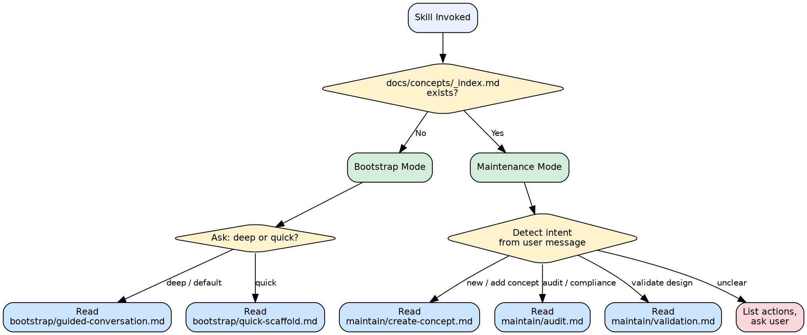

# Concept Docs — Skill Router

This skill creates and maintains a `docs/concepts/` documentation system that
makes codebase knowledge AI-agent-friendly. It produces structured templates,
ownership registries, cross-references, audit checklists, and design-validation
rules so that any AI agent working in the repo can quickly find authoritative
answers about how the platform works.

## What Gets Created

A `docs/concepts/` tree with this shape:

```
docs/concepts/
  _index.md            # Navigation hub — read first
  _ownership.md        # Entity ownership registry
  _contributing.md     # Creation checklist, templates, self-audit
  _validation.md       # Design validation checklist
  <domain>/
    README.md          # Domain overview, owned entities, related files
    data-models.md     # Entity definitions, field tables, relationships
    *.md               # Behavioral docs (api, resolution, access, etc.)
```

Each file stays under 400 lines. Cross-references link files together.
`_ownership.md` is the single source of truth for "who owns which entity."

---

## Mode Detection

The skill operates in one of two modes depending on whether the project already
has a concept documentation system.

### Detection Logic

```
Check: does docs/concepts/_index.md exist in the working directory?

  [No]  --> BOOTSTRAP MODE
  |         The project has no concept docs yet.
  |         Ask the user: deep (default) or quick?
  |
  |         [deep]  --> Read bootstrap/guided-conversation.md
  |                     Multi-round interview to discover domains,
  |                     entities, ownership, and relationships.
  |
  |         [quick] --> Read bootstrap/quick-scaffold.md
  |                     Generate scaffold from codebase scan.
  |                     Fewer questions, reasonable defaults.
  |
  [Yes] --> MAINTENANCE MODE
            Concept docs already exist.
            Detect intent from the user message.
            Route to the appropriate sub-file.

            [new concept / add concept] --> Read maintain/create-concept.md
            [audit / check compliance]  --> Read maintain/audit.md
            [validate design]           --> Read maintain/validation.md
```

### Step-by-Step

1. **Check for `docs/concepts/_index.md`** in the current working directory.
2. If the file does NOT exist, enter **Bootstrap Mode**.
   - Ask: "Would you like the **deep guided conversation** (recommended for
     first-time setup) or a **quick scaffold** from a codebase scan?"
   - Default to deep if the user does not specify.
   - Read the corresponding sub-file and follow its instructions.
3. If the file DOES exist, enter **Maintenance Mode**.
   - Parse the user's message to determine intent.
   - Route to the matching sub-file using the table below.
   - If intent is unclear, list the available maintenance actions and ask.

---

## Routing Table

### Bootstrap Mode

| User Signal                              | Sub-File                              |
| ---------------------------------------- | ------------------------------------- |
| "deep", "guided", "interview", default   | `bootstrap/guided-conversation.md`    |
| "quick", "scaffold", "scan", "fast"      | `bootstrap/quick-scaffold.md`         |

### Maintenance Mode

| User Signal                                          | Sub-File                    |
| ---------------------------------------------------- | --------------------------- |
| "new concept", "add concept", "create concept"       | `maintain/create-concept.md`|
| "audit", "check compliance", "consistency check"     | `maintain/audit.md`         |
| "validate design", "validate against concepts"       | `maintain/validation.md`    |

All sub-file paths are relative to this SKILL.md file's directory (`skill/`).

---

## Flowchart (dot format)



---

## Important Rules

These rules apply across ALL modes. Sub-files inherit them.

1. **Never duplicate content.** If information belongs in one file, link to it
   from others rather than copying.
2. **400-line limit per file.** If a file exceeds 400 lines, split it.
3. **`_ownership.md` is the single source of truth** for entity ownership. Every
   concept README must declare owned entities that match `_ownership.md`.
4. **Cross-references use relative paths.** Link between concept files using
   relative markdown links (e.g., `../permissions/resolution.md`).
5. **Self-audit after every edit.** After creating or modifying any file in
   `docs/concepts/`, run the 7-category audit from `_contributing.md`.
6. **Ask before overwriting.** If `docs/concepts/` already has content that
   would be replaced, show the user what will change and get confirmation.
7. **Stay in your lane.** This skill manages `docs/concepts/` only. It does not
   modify application code, tests, or CI configuration.

---

## Sub-File Responsibilities

Each sub-file contains the full process for its mode. This router delegates
entirely — it does NOT contain interview questions, audit checklists, or
scaffolding logic.

| Sub-File                            | Responsibility                                           |
| ----------------------------------- | -------------------------------------------------------- |
| `bootstrap/guided-conversation.md`  | Multi-round interview discovering domains, entities,     |
|                                     | ownership, relationships. Produces full `docs/concepts/` |
|                                     | tree with all meta-files and domain folders.             |
| `bootstrap/quick-scaffold.md`       | Scans codebase for entities/modules, generates scaffold  |
|                                     | with reasonable defaults, asks user to confirm/adjust.   |
| `maintain/create-concept.md`        | 8-step checklist for adding a new domain concept to an   |
|                                     | existing system. Includes templates and self-audit.      |
| `maintain/audit.md`                 | Full consistency audit: ownership, cross-refs, naming,   |
|                                     | structure, index tables. Reports violations by severity. |
| `maintain/validation.md`            | Validates a proposed design against documented platform  |
|                                     | rules. STOP/WARN/ASK on violations.                      |

---

## Quick Reference

```
/concept-docs                     # Invoke the skill
/concept-docs bootstrap           # Force bootstrap mode
/concept-docs bootstrap quick     # Quick scaffold
/concept-docs new concept         # Add a concept (maintenance)
/concept-docs audit               # Run consistency audit
/concept-docs validate            # Validate a design
```
